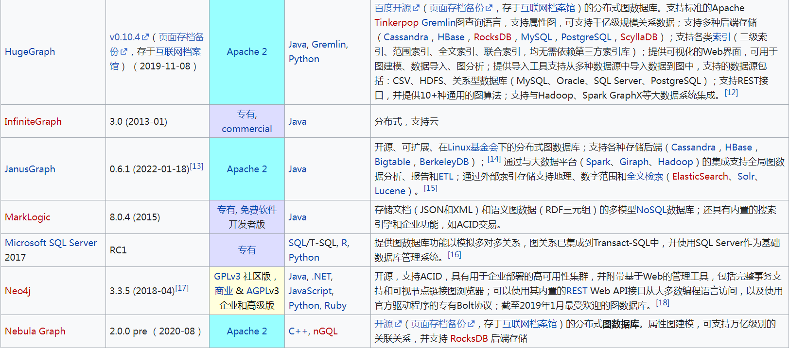

NEO4J


[neo4j_summary.md](./neo4j_summary.md)

neo4j match relatiionships without consider the self reference


中文论坛
http://neo4j.com.cn/

社区版安装启动
https://blog.csdn.net/LesserPandada/article/details/123504312
https://zhuanlan.zhihu.com/p/208318641

语法练习# ypher语法练习（MATCH、OPTIONAL MATCH）
https://blog.csdn.net/qq_37503890/article/details/101382876


CREATE 和 MERGE

导入数据
https://www.cnblogs.com/z-bear/p/12018450.html


```sql
USING PERIODIC COMMIT 1000 
LOAD CSV  FROM "file:///E:/IDA2.csv" AS row  
CREATE (:Borrower{orderno: row[0], createtime: row[1],mobile: toInt(row[2]),relationmobile: row[3], liuliangclass: row[4], createdate: row[5], createdatetime: row[6], relationmobilelist: row[7]} )

MATCH (n) RETURN n LIMIT 25


:auto USING PERIODIC COMMIT
LOAD CSV WITH HEADERS FROM 'file:///IDA2_connection_uniq.csv' AS line 
MATCH (from: Borrower {mobile: toInteger(line.originmobile)}), (to: Borrower {mobile: toInteger(line.relatedmobile)}) 
Merge(from) -[r:Contactp]->(to)

MATCH ()-[r:contactp]->() RETURN r LIMIT 100


```
LOAD CSV FROM "file:///E:/IDA2.csv" AS row  


```sql
MATCH (a:LabeofNode1), (b:LabeofNode2)
WHERE a.name = "nameofnode1" AND b.name = " nameofnode2"
CREATE (a)-\[: Relation\]->(b)
RETURN a, b
```


日期转换
https://blog.csdn.net/temotemo/article/details/80584017

https://stackoverflow.com/questions/53296991/neo4j-how-set-a-property-from-string-to-date

多个数据库
https://qinyuenlp.com/article/1376bee9b28b/


neo4j中Cypher语句delete、remove及索引
https://www.cnblogs.com/chen8023miss/p/12196188.html


py2neo数据类型（Node，relationship。。。）
https://blog.csdn.net/qq_34028001/article/details/105999515


APOC
https://blog.csdn.net/qq_38737992/article/details/89035608
https://zhuanlan.zhihu.com/p/126711126


批量更新节点属性
https://blog.csdn.net/jclian91/article/details/120357611


